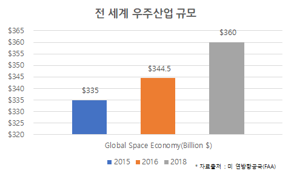
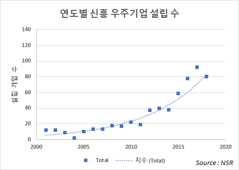
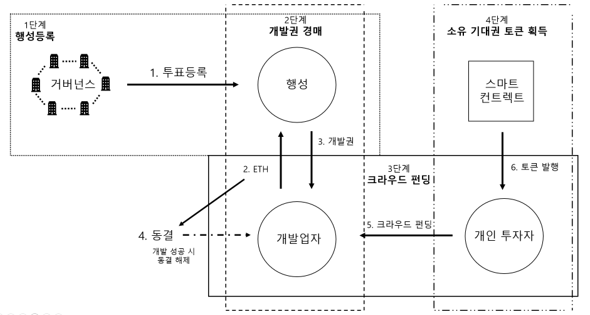

**유니블럭(Uni-Block) 사업 계획서**

**1. 사업 개요**

**1) 사업 소개**

**항공우주산업 기관 및 단체들의 개발권 경매와 행성 소유기대권에 대한
크라우드 펀딩 거래 플랫폼**

**2) 추진 목적**

행성 자원 개발의 가속화와 행성 자원 개발 완료 시의 소유권 분쟁 최소화

**2. 사업의 필요성**

**1) 현 문제상황과 사업추진을 통한 해결방안**

**\[1\] 기존의 행성 소유권 기업과의 정당성 문제**

***문제점***

1.  **행성은 소유물인가?**

현재 행성들은 인간에 의해 관리 감독될 수 없기에 인간이 소유권을 주장할
수 없다. (대한민국 민법 제 98조:
**[본법](https://ko.wikipedia.org/wiki/%EB%AF%BC%EB%B2%95)에서 물건이라
함은**
**[유체물](https://ko.wikipedia.org/w/index.php?title=%EC%9C%A0%EC%B2%B4%EB%AC%BC&action=edit&redlink=1)
및** **[전기](https://ko.wikipedia.org/wiki/%EC%A0%84%EA%B8%B0) 기타**
**[관리](https://ko.wikipedia.org/wiki/%EA%B4%80%EB%A6%AC)할 수 있는**
**[자연력](https://ko.wikipedia.org/w/index.php?title=%EC%9E%90%EC%97%B0%EB%A0%A5&action=edit&redlink=1)을
말한다. )**

2.  **미래에 행성이 소유물이 될 수 있는가?**

일본 '하야부사'의 행성 토양샘플을 채취해 돌아온 이력은 인간에 의해 관리
감독 및 사용될 수 있는 행성이 소유물의 영역에 들어갈 수 있는 가능성을
보여준다.

***해결방안***

1.  **행성 자원 소유 기대권 거래 플랫폼 설계**

> 현재는 소유물이라고 부를 수 있는 행성이 없으나, 미래에는 누군가의
> 소유물 될 가능성이 있다. 이때 만약 행성이 관리 가능한 상태가 되었을
> 경우 소유권을 주장할 수 있는 권리가 소유 기대권이다. 우리는 블록체인의
> 영속성과 투명성, 탈 중앙성을 이용하여 행성 소유 기대권의 공증과
> 영속적인 증거, 거래의 무결성을 확보할 것이다.행성 소유 기대권을 소유한
> 사람은 지구인 참여 네트워크에 의해 해당 기대권을 공증받고, 블록체인에
> 남김으로 인해 기대권에 대한 영속적인 증거를 남길 수 있다. 또한 거래
> 과정에서 위/변조가 발생하지 않는다.

**\[2\] 공동 유산으로서 행성 사용 결정 문제**

***문제점***

1.  **UN 우주조약(1967)**

> 달 및 천체는 특정 국가의 소유가 아닌 인류의 공동유산

2.  행성 사용 결정 주체가 한 기관이나 국가가 될 수 있는가?

> 노벨 경제학 수상자 엘리너 오스트름: 공유 자원 문제는 국가나 시장의
> 주도적 해결이 당연한 것이 아니라, 제3의 방안으로 자체적으로 해결할 수
> 있다 - 「 공유지의 비극을 넘어서」 중 - 공동 유산이기에 한 기관이나
> 국가가 결정하는 것은 정당하지 못하다.

3.  **이전 소유권을 주장하며 행성 판매를 진행한 기업의 정당성 문제**

> ***사례 1.** 미국인 데니스 호프는 1980년도에 달을 포함한 태양계 행성에
> 대해 개인 소유권을 주장, 1983년부터 달과 행성을 판매.*
>
> ***사례 2.** 칠레의 변호사 제나로는 칠레 정부에 돈을 지불하고 달을
> 등기*
>
> ***문제점.** 두 사례 모두 1967년 UN 우주조약(달 및 천체는 특정 국가의
> 소유가 아닌 인류의 공동유산)의 허점을 이용한 소유권을 주장하고 있으나,
> 행성은 관리 및 감독이 불가능하므로 소유권 개념이 성립되지 않아
> 정당성이 결여된다.*

***해결방안***

1.  **블록체인의 탈중앙성을 이용한 전 지구인 참여 네트워크에서의 행성
    사용 결정.**

> 공유 자원으로서 행성은 특정 국가 혹은 단체 범위의 자산이 아닌 지구인
> 전체의 것이므로, 지구인 전체가 결정권자가 되어 제 3기관 없이 합의를
> 거칠 수 있는 방법이 필요 → 모두에게 열린 참여자 네트워크가 결정권자가
> 되는 방식 사용
>
> **\[3\] 행성 자원 개발 획득의 현실성 문제**

***문제점***

1.  구매자들이 현실적으로 토큰 구매를 통한 경제적 이득을 체감할 수
    있는가 구매자들이 현실적으로 토큰 구매를 통한 경제적 이득을 체감할
    수 있는가

***해결방안***

1.  우주산업 개발 가속화 유도

```{=html}
<!-- -->
```
1.  개발 성공시에 환급되는 이더리움의 동결 해제 갈망

2.  크라우드 펀딩 투자자들의 견제로 개발 성공에 대한 기관들의 개발
    가속화 의지 제고.

**2) 블록체인 사용의 당위성**

1.  **탈중앙화**

> **중앙화 된 기관이 아닌 블록체인 네트워크 참여자의 공증을 얻을 수
> 있으며 미국 및 러시아 중심의 중앙화 된 권력구조를 해체함으로써 행성
> 소유기대권 개념에서의 탈중앙화를 가져올 수 있다.**

2.  **데이터의 영속성**

> **개발에 오랜 시간이 걸리는 항공우주산업의 특성상 구매한 행성의
> 소유기대권에 대해 후손에게 상속이 가능하다.**

3.  **데이터 위/변조의 불가능성**

> **행성의 경매 과정이 비공개 경매로 진행되기 때문에 데이터 위/변조의
> 중요성이 대두되며, 이 과정에서 투명성이 확보되었기에 크라우드 펀딩의
> 상황 또한 투명하게 확인하여 사용자에게 신뢰감을 제공할 수 있다.**

**3. 시장 현황 및 전망**

**1) 우주 산업의 고\[高\]성장세\
**{width="3.216418416447944in"
height="1.929851268591426in"}
{width="2.740359798775153in"
height="1.9559886264216972in"}

**2) 여러 민간 기업의 우주 산업 참여 가속화**

1.  **ESA & JAXA**

> 수성 탐사선 프로젝트 : 베피콜롬보 탐사선 발사 -\> 수성의 고유자기장과
> 자기권, 수성의 표면 지형과 광물, 화학적 구성 정밀 조사

2.  **Deep Space Industries(DSI)**

> 소행성 자원 채굴 목표로 설립, 우주에서 물, 광물 등의 자원을 채취하여
> 가공한 후 지구로 복귀. 우주 자원을 이용해 지구 궤도를 돌며 운영중인
> 우주시스템에 연료 제공 계획

3.  **버진 갤럭틱(Virgin gallatic)**

> 유인우주선 '스페이스십 투'로 3명의 인원을 쏘아올리는 시험비행 성공,
> 우주에서 가치있는 자원을 찾기 위한 시도 계획

**행성 자원에서 실질적인 이득을 얻으려는 투자와 민간 기업들의 참여가
늘어나고 있다. 이를 고려해 보았을 때, 참여자 네트워크를 통해서 행성 자원
소유 기대권을 공증하고 이의 영속적인 증거가 보장되는 플랫폼이
만들어진다면 많은 거래 희망자가 생길 거라고 예측된다.**

**4. 제품 소개**

**1) 행성 자원 소유 기대권 플랫폼 흐름도**

{width="5.314985783027121in"
height="2.837661854768154in"}

1.  **행성등록**

-   **거버넌스 등록**

**거버넌스의 참여자격은 오라클 문제에 대한 서비스를 제공하는
제3기업(체인링크, etc...)과의 협업을 통해 항공우주산업에 5년 이상 종사한
기업으로 설정(LIBRA의 거버넌스 구축 조건에서 착안).**

-   **행성 등록 투표**

**경매에 등록할 행성은 거버넌스에 속한 기업들의 투표를 통해 결정하며,
투표방식은 비잔틴 장군문제를 해결한 방식(pbft 논문 발췌)에 의거해
진행된다.**

2.  **개발권 경매**

**행성 등록 완료 시, 해당 행성의 개발권 경매가 시작됨. 등록된 행성에
개발의지가 있는 사용자들은 이더리움으로 입찰을 하며, 최고 입찰가를
제시한 사용자가 행성에 대한 개발권을 낙찰받는다. 모든 경매 과정은
블록체인에 기록되어 블록체인 네트워크상의 경매참여자 모두에게 보여지며
블록체인의 탈 중앙화를 통해 제 3 기관이 아닌 네트워크 참여자들을 통한
공증을 얻을 수 있다.**

**낙찰 받은 사용자(개발 업자)가 입찰한 이더리움은 개발 업자의 개발 동기
부여와 투자금 횡령후 잠적 등 사기를 방지하기 위해 행성 개발 성공시 동결
해제되어 개발업자에게 환원된다.**

3.  **크라우드 펀딩**

**투자자가 해당 행성의 개발 가능성을 보고 투자를 원한다면 행성의 토큰을
구매하여 개발 업자에게 투자의 기회를 얻는다.** $Z$**(단** $Z$ **는
실수)개의 이더리움은 1개의 TKN과 매핑되며 이때** $Z$**는 거버넌스에 의해
고정적으로 정해진다. 즉, 사용자가 토큰을 얻기위해** $N$**개의 이더를
보내면** $N/Z$ **개의 토큰을 얻는다. 얻어진 토큰은 거래가 불가능하며
개발 업자가 사업을 완료했을 시 거래가 가능해진다.**
