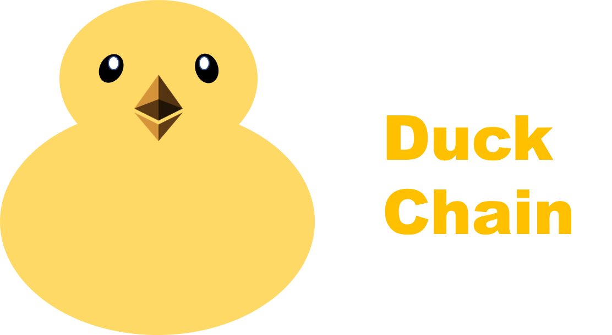

# Duck Chain : Mania's playground through the Block Chain 
## Introduction

Most of us have more than one hobby.
The Duck Chain provides playgrounds for various enthusiasts through the block chain.

## What's difference from traditional internet community.

1. You can leave the data on the blockchain that we want to keep permanently with our archive.
2. Non-Fungible Token (NFT) can be used to clarify ownership of tickets, goods, etc.
3. Transaction capabilities enable you to move beyond time and space and transparent cloud funding without intervention by an intermediary administrator.

## Why we use Block Chain?
Blockchain features security, transparency, decentralization, scalability, and reliability. Traditional community services have the following challenges.
1. **Ownership dispute over goods, tickets, etc : Security**   
Fake issues such as limited-edition products and famous concert tickets have been tried in various ways, but they still remain problems. In fact, according to the New York Times, about five times a week there is a "fake ticket" problem on Broadway, especially in a "hot" musical where tickets are hard to buy. These problems are addressed using NFT(Non-Fungible Token). Blockchain technology shows and shares transaction details to all users, making it difficult to fabricate or falsify. The combination of these characteristics makes it possible to prevent ticket-related fraud or crime.
2. **Persistent Preservation of Posts and Contents : Decentralization, Persistency**   
For enthusiasts, there is a desire to keep a record of writing, photography, etc. However, traditional centralized fan sites are vulnerable in terms of permanent retention of data, for example, due to sudden closures. Currently, the mania community is centrally managed, managed by the cafe's manager, and in the case of boards that are not managed, the members' creations are deleted or neglected.   
Recently, unlike most recent Internet services that guide users to back up their data at the end of the service, Cyworld did not take any action at first, causing a lot of anxiety among users. The decentralization of the blockchain can solve these problems and keep records permanently.
3. **Securing transparency in fundraising: Transparency**   
Case of embezzlement: A lot of times, such as tributes for one's favorite object and joint purchases of goods, which often occur in this regard, is the opacity of accounting books. Recently, a member of singer Song Ga-in's fan club said,"We are suspicious of the fan club's embezzlement and there is a lot of spending without any record". Using blockchain, accounting books such as transaction details will be disclosed to all, which is expected to ensure transparency in transactions.
